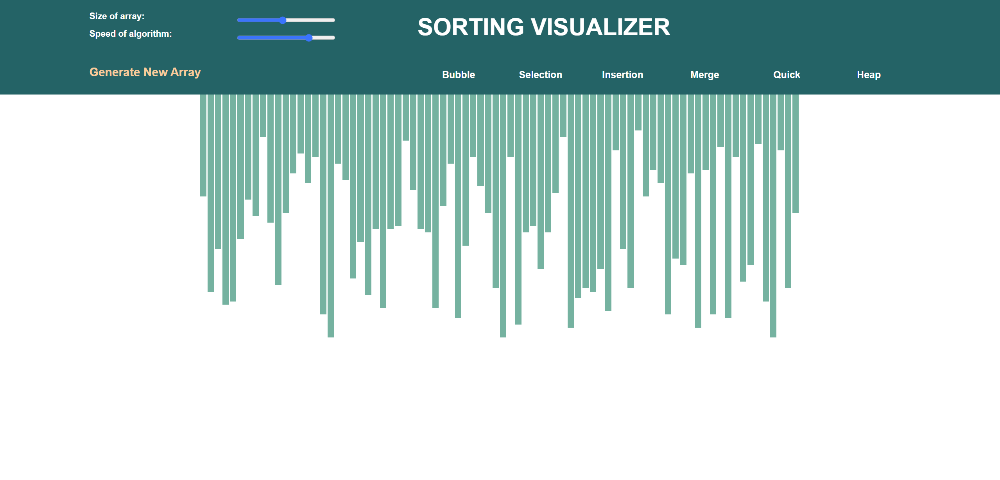
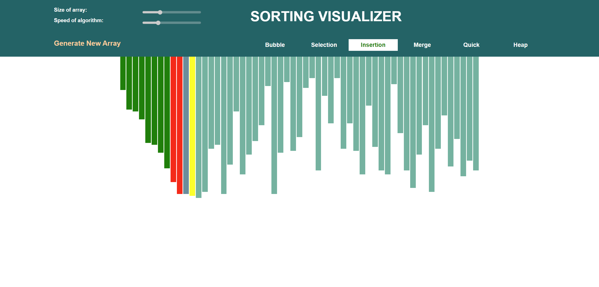

# Sorting Visualizer
A visual representation of some of the common sorting algorithms.

# About the Project
This project helps you visualize six most common sorting algorithms which are a part of every Data Structure and Algorithm Curriculum namely, Bubble Sort, Selection Sort, Insertion Sort, Merge Sort, Quick Sort, Heap Sort.

This visualization help you understand how different algorithms work and how much time each algorithm takes to sort a given array.

# How to use the UI
1. Adjust the size of array as well as the speed of the sort using two sliders at the top left.
2. In order to generate a new random array, click on the Generate New Array Button.
3. After that click on any one of the six sorting algorithms available, post which the sorting with start automatically.

# Understanding the Color Scheme of the vertical bars

During the sorting process, the bars will have either of the three colors: red, yellow and green
1. Green: This means that the given bar is at its correct position.
2. Yellow: This means that the algorithm is currently looking at that particular bar.
3. Red: This means that the particular bar is changing its position.